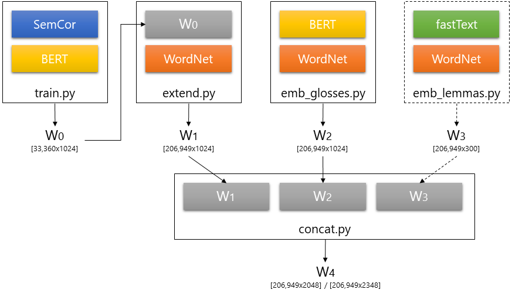

# Language Modelling Makes Sense (ACL 2019)

This repository includes the code to replicate the experiments in the ["Language Modelling Makes Sense (ACL 2019)"]() paper.

This project is designed to be modular so that others can easily modify or reuse the portions that are relevant for them. Its composed of a series of scripts that when run in sequence produce most of the work described in the paper (for simplicity, we've focused this release on BERT, let us know if you need ELMo).

## Table of Contents

- [Installation](#installation)
- [Download Sense Embeddings](#download-sense-embeddings)
- [Create Sense Embeddings](#create-sense-embeddings)
- [WSD Evaluation](#wsd-evaluation)
- [WiC Challenge](#wic-challenge)
- [Experiment 1 - Mapping Context to Concepts](#experiment-1---mapping-context-to-concepts)
- [Experiment 2 - Exploring Biases](#experiment-2---exploring-biases)
- [References](#references)

## Installation

### Prepare Environment

This project was developed on Python 3.6.5 from Anaconda distribution v4.6.2. As such, the pip requirements assume you already have packages that are included with Anaconda (numpy, etc.).
After cloning the repository, we recommend creating and activating a new environment to avoid any conflicts with existing installations in your system:

```bash
$ git clone https://github.com/danlou/LMMS.git
$ cd LMMS
$ conda create -n LMMS python=3.6.5
$ conda activate LMMS
# $ conda deactivate  # to exit environment when done with project
```

### Additional Packages

To install additional packages used by this project run:

```bash
pip install -r requirements.txt
```

The WordNet package for NLTK isn't installed by pip, but we can install it easily with:

```bash
$ python -c "import nltk; nltk.download('wordnet')"
```

### External Data

Download pretrained BERT (large-cased)

```bash
$ cd external/bert  # from repo home
$ wget https://storage.googleapis.com/bert_models/2018_10_18/cased_L-24_H-1024_A-16.zip
$ unzip cased_L-24_H-1024_A-16.zip
```

If you're interested in sense embeddings composed with static word embeddings (e.g. for Uninformed Sense Matching), download pretrained fastText.

```bash
$ cd external/fastText  # from repo home
$ wget https://dl.fbaipublicfiles.com/fasttext/vectors-english/crawl-300d-2M-subword.zip
$ unzip crawl-300d-2M-subword.zip
```

If you want to evaluate the sense embeddings on WSD, you need the [WSD Evaluation Framework](http://lcl.uniroma1.it/wsdeval/).

```bash
$ cd external/wsd_eval  # from repo home
$ wget http://lcl.uniroma1.it/wsdeval/data/WSD_Evaluation_Framework.zip
$ unzip WSD_Evaluation_Framework.zip
```

### Loading BERT

One of our main dependencies is [bert-as-service](https://github.com/hanxiao/bert-as-service), which we use to retrieve BERT embeddings from a separate process (server/client mode) so that BERT doesn't need to be reloaded with each script. It also includes additional features over other BERT wrappers for improved performance at scale. The client and server packages should have been installed by the previous `pip install' command, so now we need start the server with our parameters before training or running experiments.

Throughout this project, we expect a GPU with at least 8GB of RAM at GPUID 0. If you have more/less GPU RAM available, you can adjust the batch_size and max_seq_len parameters.

```bash
$ bert-serving-start -pooling_strategy NONE -model_dir data/bert/cased_L-24_H-1024_A-16 -pooling_layer -1 -2 -3 -4 -max_seq_len 512 -max_batch_size 32 -num_worker=1 -device_map 0 -cased_tokenization
```

After the server finishes preparing BERT for inference, you should see a message like this:

```bash
I:VENTILATOR:[__i:_ru:163]:all set, ready to serve request!
```

Now you need to leave this process running in this session and open a new session (i.e. new terminal or tab), return to the repository, reactivate the environment and continue with the next steps.

```bash
$ cd LMMS  # change according to the location of your clone
$ conda activate LMMS
```

## Download Sense Embeddings

If you don't need to create your own sense embeddings and prefer using pretrained, you can download the embeddings we produced for the paper from the links below. The '.txt' files are in standard GloVe format, and the '.npz' are in a compressed numpy format that's also much faster to load (check [vectorspace.py]() for the code that loads these).

- LMMS 1024 (bert-large-cased) \[[.txt (2.0GB)](https://drive.google.com/uc?id=10NeeLfjP4ZmromV6t8i4K-J-daNir9Qo&export=download)\] \[[.npz (0.3GB)](https://drive.google.com/uc?id=1kuwkTkSBz5Gv9CB_hfaBh1DQyC2ffKq0&export=download)\] 
- LMMS 2048 (bert-large-cased) \[[.txt (4.0GB)](https://drive.google.com/uc?id=1NiQ-ZeICyR18ErK3BKRXnoIxe97xAyvo&export=download)\] \[[.npz (1.4GB)](https://drive.google.com/uc?id=15kJ8cY63wUwiMstHZ5wsX4_JFLnLJTjZ&export=download)\] 
- LMMS 2348 (bert-large-cased, fasttext-crawl-subword-600B) \[[.txt (4.6GB)](https://drive.google.com/uc?id=1c_ip1YvySNZ-Q27sd4f9cE3Fytv7WzKK&export=download)\] \[[.npz (1.7GB)](https://drive.google.com/uc?id=1bwXfp-lUI91JBb5WE02ExAAHT-t3fhiN&export=download)\] 

Place sense embeddings in data/vectors/.

## Create Sense Embeddings

The creation of sense embeddings involves a series of steps that have corresponding scripts. The diagram below shows how these scripts interact to create the sense embeddings described in the paper.



Below you'll find usage descriptions for all the scripts along with the exact command to run in order to replicate the results in the paper.

### 1. [train.py](https://github.com/danlou/LMMS/blob/master/train.py) - Bootstrap sense embeddings from annotated corpora

Usage description.

```bash
$ python train.py -h
usage: train.py [-h] [-wsd_fw_path WSD_FW_PATH]
                [-dataset {semcor,semcor_omsti}] [-batch_size BATCH_SIZE]
                [-max_seq_len MAX_SEQ_LEN] [-merge_strategy {mean,first,sum}]
                [-max_instances MAX_INSTANCES] -out_path OUT_PATH

Create Initial Sense Embeddings

optional arguments:
  -h, --help            show this help message and exit
  -wsd_fw_path WSD_FW_PATH
                        Path to WSD Evaluation Framework. (default: external/wsd_eval/WSD_Evaluation_Framework/)
  -dataset {semcor,semcor_omsti}
                        Name of dataset (default: semcor)
  -batch_size BATCH_SIZE
                        Batch size (BERT) (default: 32)
  -max_seq_len MAX_SEQ_LEN
                        Maximum sequence length (BERT) (default: 512)
  -merge_strategy {mean,first,sum}
                        WordPiece Reconstruction Strategy (default: mean)
  -max_instances MAX_INSTANCES
                        Maximum number of examples for each sense (default: inf)
  -out_path OUT_PATH    Path to resulting vector set (default: None)
```

To replicate, use as follows:

```bash
$ python train.py -dataset semcor -batch_size 32 -max_seq_len 512 -out_path data/vectors/semcor.32.512.txt
```

### 2. [extend.py](https://github.com/danlou/LMMS/blob/master/extend.py) - Propagate supervised representations (sense embeddings) through WordNet

Usage description.

```bash
$ python extend.py -h
usage: extend.py [-h] -sup_sv_path SUP_SV_PATH
                 [-ext_mode {synset,hypernym,lexname}] -out_path OUT_PATH

Propagates supervised sense embeddings through WordNet.

optional arguments:
  -h, --help            show this help message and exit
  -sup_sv_path SUP_SV_PATH
                        Path to supervised sense vectors
  -ext_mode {synset,hypernym,lexname}
                        Max abstraction level
  -out_path OUT_PATH    Path to resulting extended vector set
```

To replicate, use as follows:

```bash
python extend.py -sup_sv_path data/vectors/semcor.32.512.txt -ext_mode lexname -out_path data/vectors/semcor_ext.32.512.txt
```

### 3. [emb_glosses.py](https://github.com/danlou/LMMS/blob/master/emb_glosses.py) - Create sense embeddings based on WordNet's glosses and lemmas

Usage description.

```bash
$ python emb_glosses.py -h
usage: emb_glosses.py [-h] [-batch_size BATCH_SIZE] -out_path OUT_PATH

Creates sense embeddings based on glosses and lemmas.

optional arguments:
  -h, --help            show this help message and exit
  -batch_size BATCH_SIZE
                        Batch size (BERT)
  -out_path OUT_PATH    Path to resulting vector set
```

To replicate, use as follows:

```bash
$ python emb_glosses.py -out_path data/vectors/wn_glosses.txt
```

**NOTE:** To replicate the results in the paper we need to restart bert-as-service with a different pooling strategy just for this step.
Stop the previously running bert-as-service process and restart with the command below.

```bash
$ bert-serving-start -pooling_strategy REDUCE_MEAN -model_dir data/bert/cased_L-24_H-1024_A-16 -pooling_layer -1 -2 -3 -4 -max_seq_len 256 -max_batch_size 32 -num_worker=1 -device_map 0 -cased_tokenization
```

After this step (emb_glosses.py) is concluded, stop this instance of bert-as-service and restart with the [previous parameters](#loading-bert).

For a better understanding of what strings we're actually composing to generate these sense embeddings, here are a few examples:

| Sensekey (sk) | Embedded String (sk's lemma, all lemmas, tokenized gloss) |
|:-------------:|:---------------------------------------------------------:|
|    earth%1:17:00::     | earth - Earth , earth , world , globe - the 3rd planet from the sun ; the planet we live on    |
|    globe%1:17:00::     | globe - Earth , earth , world , globe - the 3rd planet from the sun ; the planet we live on    |
|    disturb%2:37:00::   | disturb - disturb , upset , trouble - move deeply                                              |


### 4. [emb_lemmas.py](https://github.com/danlou/LMMS/blob/master/emb_lemmas.py) - \[Optional\] Create sense embeddings from lemmas (static, many redundant)

Usage description.

```bash
$ python emb_lemmas.py -h 
usage: emb_lemmas.py [-h] [-ft_path FT_PATH] -out_path OUT_PATH

Creates static word embeddings for WordNet synsets (lemmas only).

optional arguments:
  -h, --help          show this help message and exit
  -ft_path FT_PATH    Path to fastText vectors
  -out_path OUT_PATH  Path to resulting lemma vectors
```

To replicate, use as follows:

```bash
$ python emb_lemmas.py -out_path data/vector/wn_lemmas.txt
```

### 5. [concat.py](https://github.com/danlou/LMMS/blob/master/concat.py) - Bringing it all together

Usage description.

```bash
$ python concat.py -h    
usage: concat.py [-h] -v1_path V1_PATH -v2_path V2_PATH [-v3_path V3_PATH]
                 -out_path OUT_PATH

Concatenates and normalizes vector .txt files.

optional arguments:
  -h, --help          show this help message and exit
  -v1_path V1_PATH    Path to vector set 1
  -v2_path V2_PATH    Path to vector set 2
  -v3_path V3_PATH    Path to vector set 3. Missing vectors are imputated from v2 (optional)
  -out_path OUT_PATH  Path to resulting vector set
```

To replicate, use as follows:

- For LMMS_2348:

```bash
$ python concat.py -v1_path data/vector/wn_lemmas.txt -v2_path data/vectors/wn_glosses.txt -v3_path data/vectors/semcor_ext.32.512.txt -out_path data/vectors/lmms_2348.txt
```

- For LMMS_2048:

```bash
$ python concat.py -v1_path data/vectors/wn_glosses.txt -v2_path data/vectors/semcor_ext.32.512.txt -out_path data/vectors/lmms_2048.txt
```

## WSD Evaluation

| Sense Embeddings (1-NN) | Senseval2 | Senseval3 | SemEval2007 | SemEval2013 | SemEval2015 | ALL |
|:---:|:----:|:----:|:----:|:----:|:----:|:----:|
| MFS | 66.8 | 66.2 | 55.2 | 63.0 | 67.8 | 65.2 |
| LMMS 1024 | 75.4 | 74.0 | 66.4 | 72.7 | 75.3 | 73.8 |
| LMMS 2048 | 76.3 | 75.6 | 68.1 | 75.1 | 77.0 | 75.4 |

Run the commands below to replicate these results with [pretrained embeddings](#download-sense-embeddings).

### Baseline - Most Frequent Sense

Usage description.

```bash
$ python eval_mfs.py -h
usage: eval_mfs.py [-h] [-wsd_fw_path WSD_FW_PATH]
                   [-test_set {senseval2,senseval3,semeval2007,semeval2013,semeval2015,ALL}]

Most Frequent Sense (i.e. 1st) evaluation of WSD Evaluation Framework.

optional arguments:
  -h, --help            show this help message and exit
  -wsd_fw_path WSD_FW_PATH
                        Path to WSD Evaluation Framework.
  -test_set {senseval2,senseval3,semeval2007,semeval2013,semeval2015,ALL}
                        Name of test set
```

To replicate, use as follows:

```bash
$ python eval_mfs.py -test_set ALL
```

**NOTE:** This implementation of MFS is slightly better (+0.4% F1 on ALL) than the MFS results we report in the paper (which are reproduced from Raganato et al. (2017a)).

### Nearest Neighbors

Usage description.

```bash
$ python eval_nn.py -h
usage: eval_nn.py [-h] -sv_path SV_PATH [-ft_path FT_PATH]
                  [-wsd_fw_path WSD_FW_PATH]
                  [-test_set {senseval2,senseval3,semeval2007,semeval2013,semeval2015,ALL}]
                  [-batch_size BATCH_SIZE] [-merge_strategy MERGE_STRATEGY]
                  [-ignore_lemma] [-ignore_pos] [-thresh THRESH] [-k K]
                  [-quiet]

Nearest Neighbors WSD Evaluation

optional arguments:
  -h, --help            show this help message and exit
  -sv_path SV_PATH      Path to sense vectors (default: None)
  -ft_path FT_PATH      Path to fastText vectors (default: external/fastText/crawl-300d-2M-subword.bin)
  -wsd_fw_path WSD_FW_PATH
                        Path to WSD Evaluation Framework. (default: external/wsd_eval/WSD_Evaluation_Framework/)
  -test_set {senseval2,senseval3,semeval2007,semeval2013,semeval2015,ALL}
                        Name of test set (default: ALL)
  -batch_size BATCH_SIZE
                        Batch size (BERT) (default: 32)
  -merge_strategy MERGE_STRATEGY
                        WordPiece Reconstruction Strategy (default: mean)
  -ignore_lemma         Ignore lemma features (default: True)
  -ignore_pos           Ignore POS features (default: True)
  -thresh THRESH        Similarity threshold (default: -1)
  -k K                  Number of Neighbors to accept (default: 1)
  -quiet                Less verbose (debug=False) (default: True)
```

To replicate, use as follows:

```bash
$ python eval_nn.py -sv_path data/vectors/lmms_1024.bert-large-cased.npz -test_set ALL
```

This script expects bert-as-service to be running. See [Loading BERT](#loading-bert).

To evaluate other versions of LMMS, replace 'lmms_1024.bert-large-cased.npz' with the corresponding LMMS embeddings file (.npz or .txt).
To evaluate on other test sets, simply replace 'ALL' with the test set's name (see options in Usage Description).
Pretrained LMMS sense embeddings are available [here](#download-sense-embeddings).

## WiC Challenge

The [Word-in-Context (WiC)](https://pilehvar.github.io/wic/) challenge presents systems with pairs of sentences that include one word in common with the goal of evaluating the system's ability to tell if both occurrences of the word share the same meaning or not. As such, while this task doesn't require assigning specific senses to words, it's very much related to Word Sense Disambiguation.

We submitted a solution based on LMMS for this challenge (2nd in ranking), exploring a few simple approaches using the sense embeddings created in this project. Further details regarding these approaches are available on the system's description paper ([arXiv]()) at [SemDeep-5 (IJCAI 2019)](http://www.dfki.de/~declerck/semdeep-5/index.html) (to appear).

You'll need to download the WiC dataset and place it in 'external/wic/':

```bash
$ cd external/wic
$ wget https://pilehvar.github.io/wic/package/WiC_dataset.zip
$ unzip WiC_dataset.zip
```

As before, these scripts expect bert-as-service to be running. See [Loading BERT](#loading-bert).

### Sense Comparison

To evaluate our simplest approach, sense comparison, use:

```bash
$ python eval_wic_compare.py -lmms_path data/vectors/lmms_2048.bert-large-cased.npz -eval_set dev
```

The other approaches involved training a Logistic Regression for Binary Classification based on different sets of embedding similarity features. 
The scripts for training and evaluating the classifier replicate the best performing solution (4 features).

### Training Binary Classifer

```bash
$ python ...
```

**NOTE:** This model is very small and already included in this repository at 'data/models/'.

### Evaluation using Classifier

```bash
$ python ...
```

This evaluation script generates a file with the predictions that can be submitted to the task's leaderboard (only for test set).

## Experiment 1 - Mapping Context to Concepts

WIP

## Experiment 2 - Exploring Biases

WIP

## References

### ACL 2019

Main paper about LMMS.  Forthcoming, to be updated ([arXiv]()).

```
@inproceedings{lmmsacl2019,
    title = "Language Modelling Makes Sense: Propagating Representations through WordNet for Full-Coverage Word Sense Disambiguation",
    author = "Loureiro, Daniel  and
      Jorge, Al{\'\i}pio",
    booktitle = "Proceedings of the 57th Annual Meeting of the Association for Computational Linguistics",
    year = "2019",
    address = "Florence, Italy",
    publisher = "Association for Computational Linguistics",
    pages = "forthcoming",
}
```

### SemDeep-5 at IJCAI 2019

Application of LMMS for the Word-in-Context (WiC) Challenge. Forthcoming, to be updated ([arXiv]()).

```
@inproceedings{LoureiroWiC,
  title={LIAAD at SemDeep-5 Challenge: Word-in-Context (WiC)},
  author={Daniel Loureiro and Al{\'\i}pio M{\'a}rio Jorge},
  booktitle={SemDeep-5@IJCAI 2019},
  pages={forthcoming},
  year={2019}
}
```